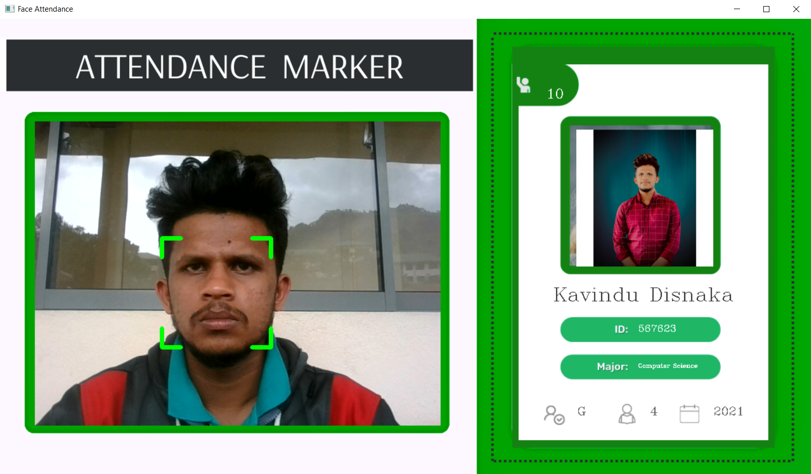

# Face-Attendance-Marker (Computer-Vision)

  

🔍 Project Overview:  
I have developed an innovative Face Attendance Marker system that leverages cutting-edge Computer Vision technology. The system enables individuals to mark their attendance using facial recognition, ensuring a seamless and efficient process. 📸✨  

🏗️ Key Features:  

Real-time facial recognition using OpenCV and face_recognition libraries.  
Dynamic database updates powered by Firebase for instant attendance logging.  
Secure and scalable data storage with Firebase Admin SDK.  
Modular and efficient code structure with libraries like NumPy and cvzone.    

📂 Technologies Used:  

Libraries: os, pickle, numpy, cv2, face_recognition, cvzone, firebase_admin  
Database: Firebase Realtime Database and Firebase Storage.  
Realtime updates ensure smooth and accurate attendance tracking.  
